# Game of Conkers
## Introduction

### Project Description
[Game of Conkers](https://behemot-biz.github.io/game-of-conkers/)
is a simple browser-based game where you play the traditional playground game of conkers against a computer opponent. The game tests your luck and strategy as you take turns swinging your conker to break your opponent's conker.

### Project Purpose
The aim of this project is to create an entertaining digital version of the classic conkers game. The game is designed to be easy to understand and play, providing a nostalgic experience for users familiar with the game and introducing it to new players.

### Look and feel on different devices

## User Stories
The Game of Conkers is designed to provide an engaging and fun experience for users who want to play a simple, turn-based game.

### Player
**User story:** As a player, I want a clear and easy-to-understand game interface so that I can quickly start playing and enjoy the game.

**End user goal:** I can easily start a new game, understand the gameplay mechanics, and see the results of each turn.

### Design decisions
### Fonts
I selected the Google Fonts "Karma" for headings and "Source Sans 3" for body text to create a visually appealing contrast.

###  --> left to do --> Colours
I used a clean and simple color scheme to keep the focus on the game:
- Background: White
- Buttons: Neutral colors with slight shades for active/inactive states

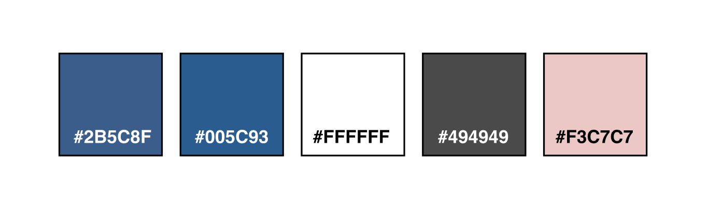

####   --> left to do --> Colour use
- Brown #582f0e - Headlines on white background, logo, hamburger icon and footer 
- Green #072B07 - Headlines on pale green background
- Pale green #f6f9f4 - Background color
- White #ffffff - Background color, icons in footer
- White whith opacity #fffffff2 - Background color
- Dark grey #3a3a3a - Bread text and navigation text

###   --> left to do --> Imagery
I used my own pictures from my garden and family. I also took new pictures of the bokashi workflow to use as illustrations in the guide.

###   --> left to do --> Wireframes

I chose to use figma for wireframe and prototyping. This is also where I wrote most of the textual content to make sure it all works together with the layout.
As you can see in the image below some design elements has changed, but most is staying true in the deployed version.

View the Prototype document (image of)

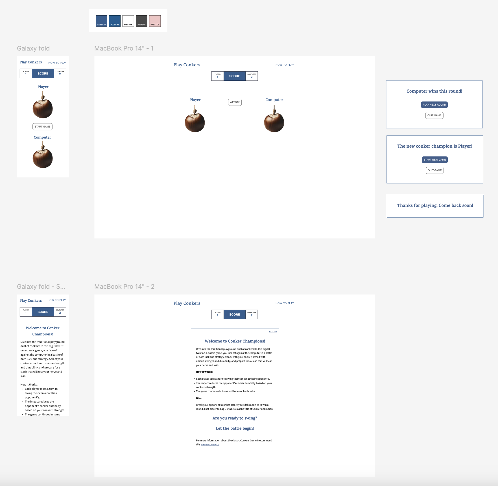

## Features

### Header and Navigation
- **Logo and Game Title:** Displays the title "Play Conkers" with a simple navigation link to "How to play".
    
     
    **Header/Navigation**

### Main Game Area
- **Score Area:** Displays the scores for the player and the computer.
- **Game Info:** Shows game messages and buttons to start a new round or quit the game.
- **Game Area:** Contains the conker images for both player and computer and buttons for starting the game and attacking.

    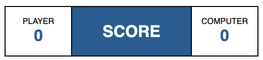 
    **Score Area**

    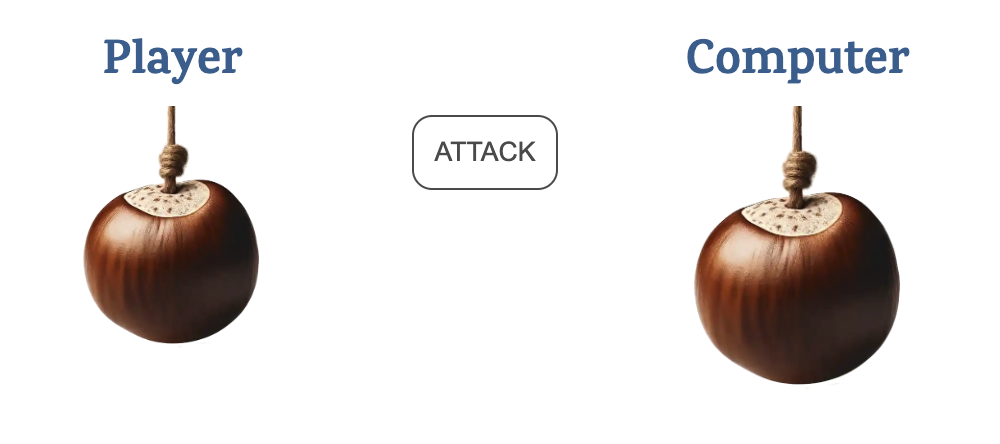 
    **Game Area**

    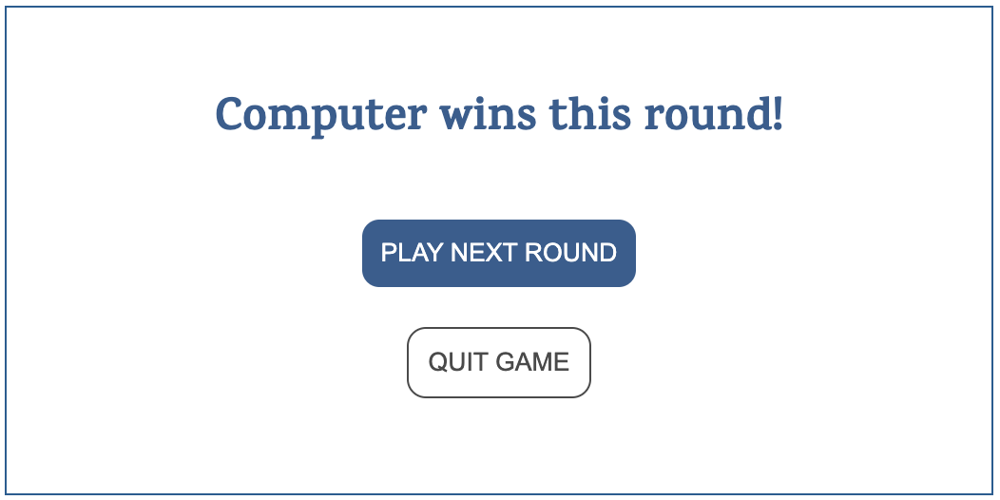 
    **Game Info - winner round**

    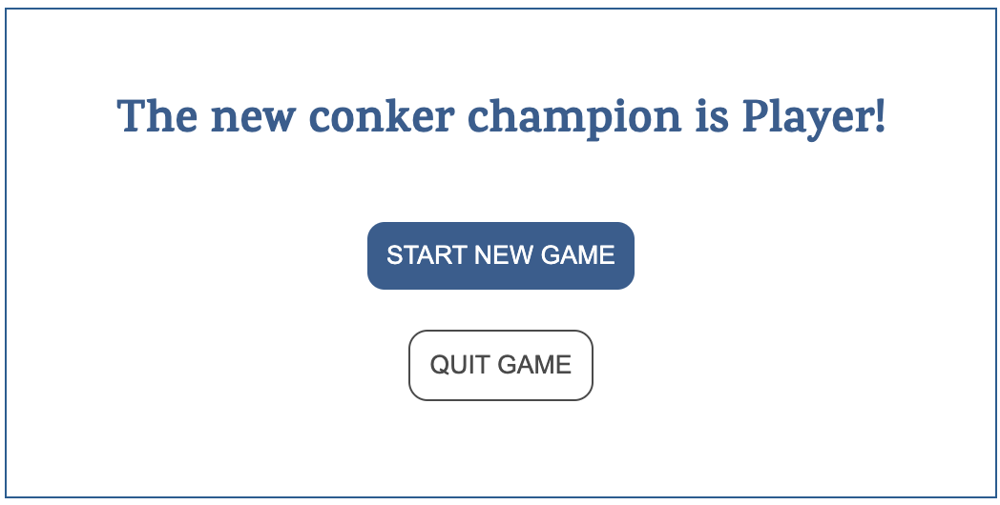 
    **Game Info - winner game**

     
    **Game Info - quit game**

### How to Play Section
- Detailed instructions on how to play the game, hidden by default but can be shown by clicking the "How to play" link.

    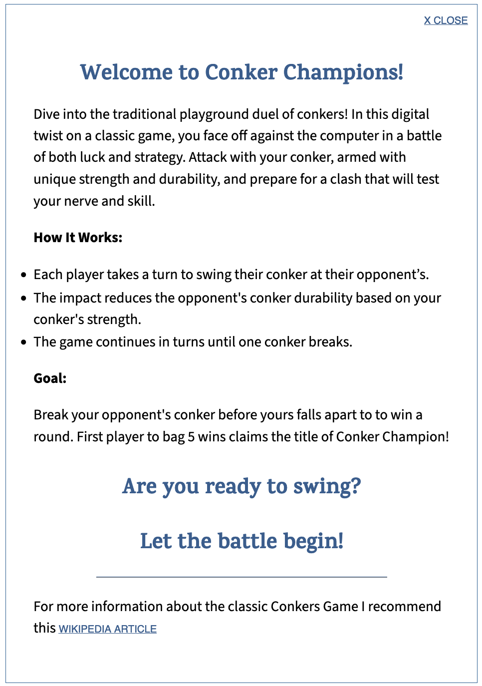 
    **How to play**

## JavaScript Functionality

### Core Functions
- **randomNumbers(min, max):** Generates random numbers for conker attributes.
- **createConker(name):** Creates a conker object with random strength and durability.
- **prepareGame():** Prepares the game by assigning conkers to the player and the computer.
- **buttonVisibilityStates(elementId, hide):** Toggles the visibility of HTML elements.
- **conkerResize(elementId, conkerSize):** Resizes the conker images based on durability.
- **startGame():** Initializes the game, setting up the conkers and UI elements.
- **playerTurn() and computerTurn():** Handles the player's and computer's turns respectively.
- **playTurn(attacker, defender):** Executes a turn, calculating damage and updating conker durability.
- **updatePlayerScore(name):** Updates the score for the player or computer.
- **checkWinScore(name):** Checks if the player or computer has won the game.
- **newGame() and resetPlayerScore(name):** Resets score board anad starts new game.
- **showAbout() and hideAbout():** Toggles the visibility of the "How to play" section.

### Event Listeners
- **DOMContentLoaded:** Initializes event listeners when the DOM is fully loaded.
- **Button Click Events:** Handlers for starting the game, attacking, and reloading the page.

## Testing

### Functionality Test (Manual Testing)
Tested across different devices and browsers to ensure the game works correctly.

## --> left to do
#### difficulties
I had a bit of struggle with the play game loop as i built it, it was playing out the game in one go. i had to rethink this and split it to use event handler for players turn and create new function for computers turn.

#### bug fix
attack button acts up.
when computers looses attack button stays red when game starts,
set attack color button to white in start game

specificity hide show gameInfo. 
  I had to move .hide and .show down in css due specificity the layer was still visible due to rearanging classes in css (moved game-info down to game-area).

—>add show to element. was missing

—> missing semicolons in two functions, found by jsHint. Bug is corrected
Need test case about the "how to play" show/hide element

#### Desktop Layout
|Feature|Expected result|Action|Status|
| --- | --- | --- | --- | 
|Start Game Button|Starts a new game|Click start game button|Pass|
|Attack Button|Player attacks computer's conker|Click attack button|Pass|
|Play Next Round Button|Sets up new round|Click play next round button|Pass|
|Quit Game Button|Displays thanks for playing message|Click quit game button|Pass|

#### Mobile Layout
|Feature|Expected result|Action|Status|
| --- | --- | --- | --- | 
|Start Game Button|Starts a new game|Click start game button|Pass|
|Attack Button|Player attacks computer's conker|Click attack button|Pass|
|Play Next Round Button|Sets up new round|Click play next round button|Pass|
|Quit Game Button|Displays thanks for playing message|Click quit game button|Pass|

The test cases were carried out on following devices/browsers: 

MacBook Pro 15-inch, 2017
- Safari Version 17.4.1 
- Firefox 124.0.2 (64-bit)
- Chrome Version 123.0.6312.124 (Official Build) (x86_64)

Ipad pro (12,9 inch IOS 16.7.7)
- Safari
- Firefox
- Chrome 

Iphone SE
- Safari
- Chrome 

Iphone 8 plus (IOS 16.7.7)
- Safari

The tests where carried out on the finalized site, no errors found.

### Code validation
#### Javascript
Passed without errors

View html validation of home/start page (image of)

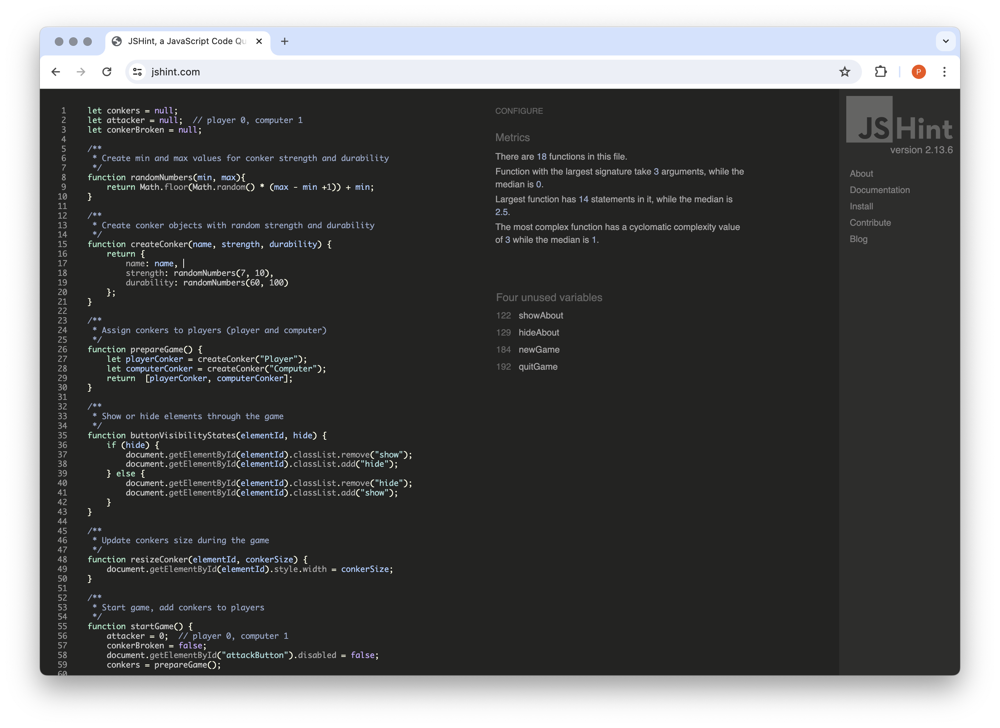

#### HTML
Passed without errors

View html validation of home/start page (image of)

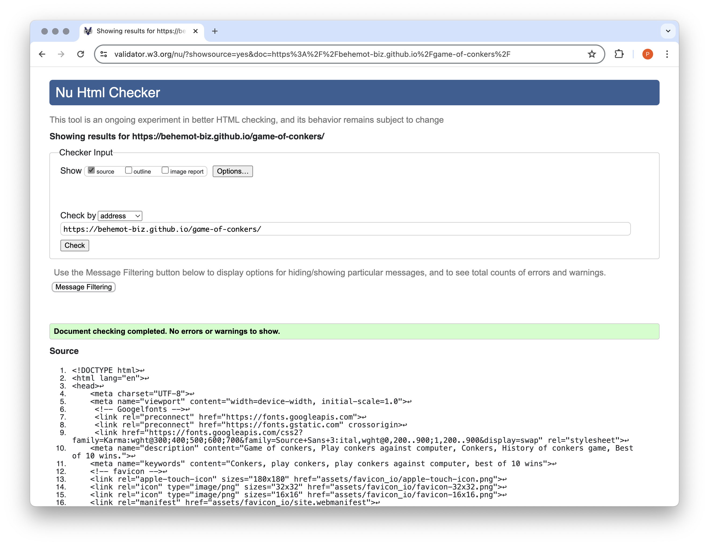

#### CSS
Passed without errors

View CSS validation (image of)

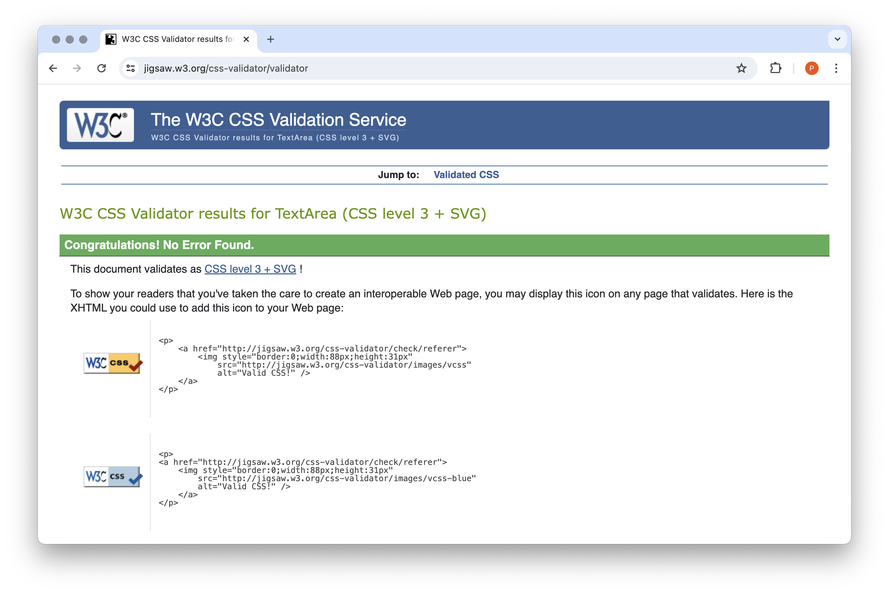

### Performance test - Lighthouse

#### Desktop

Result start/home page (image of)

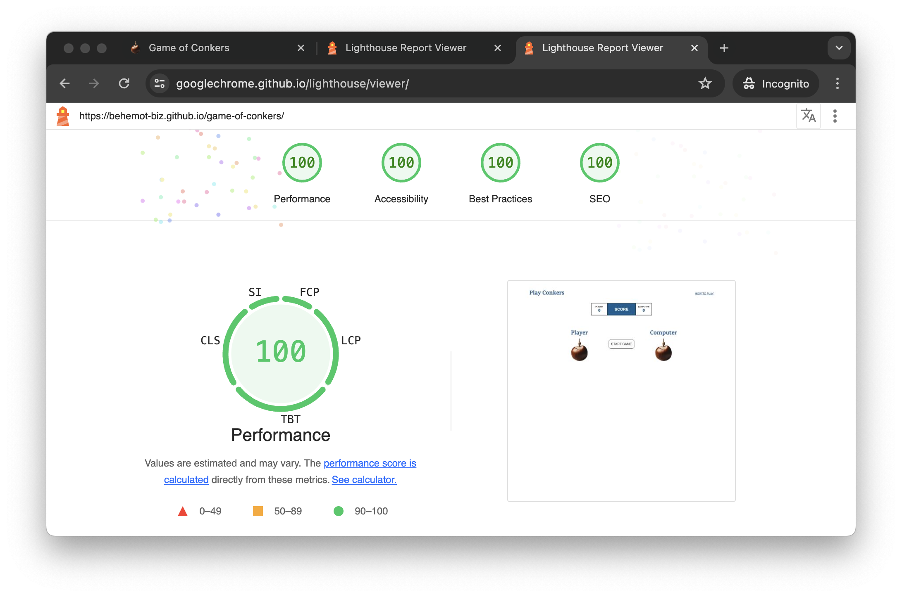

#### Mobile

Result start/home page (image of)

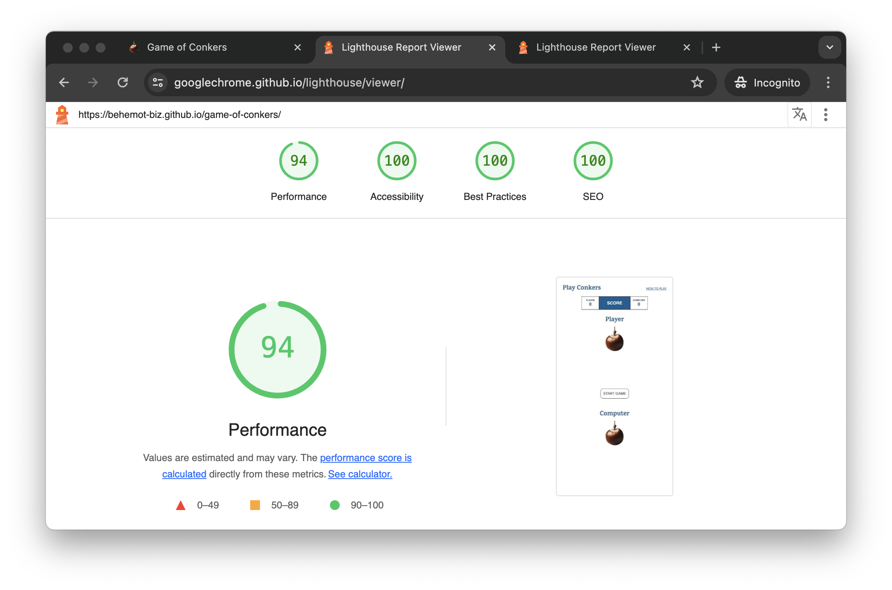

## Deployment

The game is deployed using GitHub Pages - [behemot-biz/game-of-conkers](https://behemot-biz.github.io/game-of-conkers/)

To Deploy the game using GitHub Pages:

1. Login (or signup) to GitHub.
2. Go to the repository for this project. - [behemot-biz/game-of-conkers](https://github.com/behemot-biz/game-of-conkers)
3. Click the settings button.
4. Select pages in the left-hand navigation menu.
5. From the source dropdown, select the main branch and press save.
6. The game has now been deployed. Please note that this process may take a few minutes before the game goes live.

### Local Development

#### How to Fork

To fork the repository:

1. Log in (or sign up) to GitHub.
2. Go to the repository for this project. [behemot-biz/game-of-conkers](https://github.com/behemot-biz/game-of-conkers)
3. Click the Fork button in the top right corner.

#### How to Clone

To clone the repository:

1. Log in (or sign up) to GitHub.
2. Go to the repository for this project. [behemot-biz/game-of-conkers](https://github.com/behemot-biz/game-of-conkers)
3. Click on the code button, select whether you would like to clone with HTTPS, SSH or GitHub CLI, and copy the link shown.
4. Open the terminal in your code editor and change the current working directory to the location you want to use for the cloned directory.
5. Type 'git clone' into the terminal and then paste the link you copied in step 3. Press enter.

## Technologies

**Programs used:**
- Vscode (html, css and javascript)
- Photoshop (edit images)
- Figma (wireframe/prototyping)

**Browsers:**
- Firefox
- Chrome
- Safari

**Languages:**
- HTML 5
- CSS 3
- JavaScript

**Web tools:**
- [GitHub](https://github.com) (repository)
- [Favoicon](https://favicon.io/favicon-converter) (generate favicon)
- [Google fonts](https://fonts.google.com/) (font api for loading fonts)
- [Am i responsive](https://ui.dev/amiresponsive) (generate image on different devices)
- [Markup validation Service](https://validator.w3.org) (html code validation)
- [CSS validation service](https://jigsaw.w3.org/css-validator) (css code validation)
- [JSFiddle - Code Playground](https://jsfiddle.net) (advice from mentor)
- [JSHint](https://jshint.com) (javascript code validation)
- [Dillinger](https://dillinger.io) (Readme editor)

## Ideas for future implementation
- Multi-player
- Configuration options for each round like bake in oven, soak in viniger etc.
- Feature for one-ers, two-ers and a more realistic score count to better mimic the game.
- Leader board.

The list can be made as long as the tradition of the game. 

## Credits

### Code inspiration

[What is setTimeout in JavaScript and how to work with it?](https://codedamn.com/news/javascript/what-is-settimeout-in-javascript) 
How to set time out and then call computers turn.
- playerTurn()

[How to transform string to lowercase letters.](https://www.w3schools.com/jsref/jsref_tolowercase.asp)  
 Needed to transform name of player/computer to update score (id lowercase, name contains uppercase letter) 
- updatePlayerScore(name)
- checkWinScore(name)
- resetPlayerScore(name)

Header (logo/nav) is very loosley based on the CI project "Love Running"

[Correct use of event listener and show/hide elements](https://jsfiddle.net/rcoyaubq/) 
I receved support from my mentor Rohit Sharma on how to better handle show/hide elements.
-  buttonVisibilityStates(elementId, hide)

How to properly set up the event listeners
- DOMContentLoaded
- Button Click Events

**Readme guidance**

[README.md - How, What and When?](https://www.youtube.com/watch?v=l1DE7L-4eKQ) 

[Kera Cudmore's readme examples](https://github.com/kera-cudmore/readme-examples)  
I copied the deployment section from this example.

**Thanks to my friends and family for testing the game and providing feedback.**

**Special thanks**
Special thanks to my husband Jimi for patience and support with the copywriting and proofreading of all texts both site and readme. 
Fellow students in the Swedish channel 
And a very Special thank you goes to Mentor Rohit Sharma for excellent support!

**Enjoy playing the Game of Conkers!**
